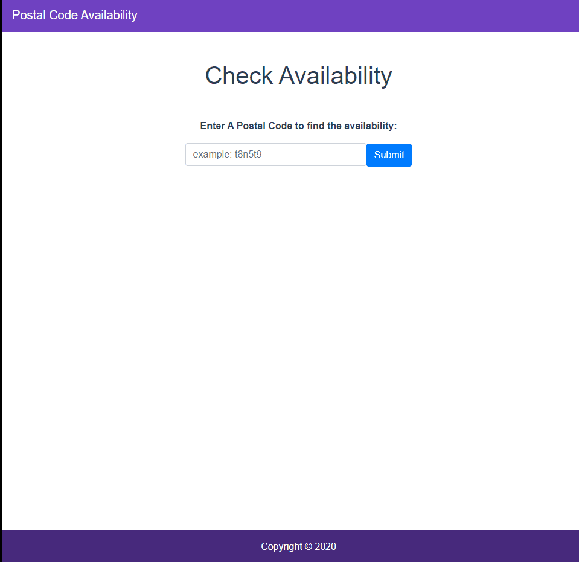

# Postal Code Checker
 
This is a demo using Node.js and Vue.js. 

<a href="https://postalcode-ex-deploy.herokuapp.com/" style="padding: 1rem; color: #fff; background-color: #007bff; border-color: #007bff; border-radius: 3px;">View Demo</a>

## Installation 

First clone the project. Then run:

- `cd client && npm i`
- `cd ../server && npm i`

After all node modules have been installed, open 2 separate terminals and run:

### client
`npm run serve`

### server
`npm run start`

**Note:** If you experience an error with the server regarding Nodemon, you may need to install it globally(`npm i -g nodemon`) or just run `node app.js`);

## Screenshot

